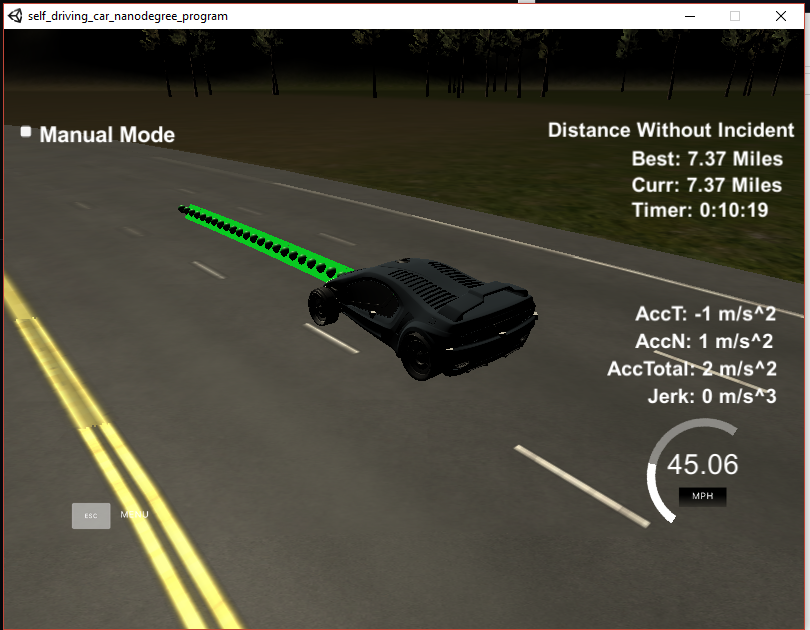

# Readme
In this readme I want to describe the main functions of my approach to the "Path Planning Project" of the third term of the Udacity Self Driving Car Nanodegree. Following the chronoligal approach to this problem I first want to discuss the function that the creates the imminent trajectory of the car. Secondly I describe the helper functions, that I added to the program, shortly. After that, I explain my approach of the algorithm that decides which lane to change to next (and how) in the main function.
Finally I discuss my approach to this problem.

## Trajectory Creator

The file `Trajectory create_splines_xt_yt(vector<double> car_data,vector<double> previous_x, vector<double> previous_y, vector<double> goal, vector<double> map_waypoints_s, vector<double> map_waypoints_x, vector<double> map_waypoints_y, vector<vector<double>> sensor_fusion)` consists of two parts. In the first part the actual trajectory is generated. In the second part this trajectory's quality is rated using a cost function. The function returns a structure that contains the trajectory, the total cost of the trajectory, how long it takes to reach the goal, if a lane change is included in reaching the goal.

### Part 1: Trajectory generator

Similar to the "Walkthrough" of the Q&A Video, I used the `spline.h` [from here ]([[https://kluge.in-chemnitz.de/opensource/spline/](https://kluge.in-chemnitz.de/opensource/spline/)](https://kluge.in-chemnitz.de/opensource/spline/%5D(https://kluge.in-chemnitz.de/opensource/spline/))) for the the trajectory generator. In the video a trajectory of Y(x) in car coordinates was created, in which new points for the simulator were determined by the time-step of the simulator (0.02s) and a desired velocity.
My approach is different:
I create two different splines x(t) and y(t) in world coordinates. Those splines determine the trajectory of the car from the last data point of the previous path at time `t_0` to a goal at time `t_1` that is given to the generator depending where the car should go next. Following points in time are determined and handed to the spline generator (in chronological order):

- `t_m1` ( --> `x_m1`, `y_m1`), `t_m2 `( --> `x_m2`, `y_m2` ) : These points are *minus 1* and *minus 2* of the starting point `t_0`. They are taken from the end points of the previous path and determine the first and second derivatives of the splines at t=t_0. In other words those data points ensure that there is a smooth transition in speed v_x, v_y and acceleration a_x, a_y at the point of transfer from the last points previous path (that are still going to be used in the next simulation step) to the new generated trajectory points. In case the previous path has not enough data-points yet (at the very beginning) a very low continuous speed along the car's yaw angle is approximated using equidistant points "behind" the car position and thus setting the current acceleration to zero.

- `t_0` ( --> `x_0`, `y_0`) : This is the last data point from the previous path. If the previous path has a length of zero (at the beginning) the current position of the car is taken.

- `t_1` ( --> `x_1`, `y_1`) : The most important time point, the "goal" of the trajectory.The car is supposed to be there at a certain "goal_velocity". `x_1`, `y_1` are determined by transforming the frenet coordinates given to the trajectory generator (*s: car_position + distance to travel* and *d: goal-lane x 4+2*). Further information about the definition of this point further down.

- `t_2` ( --> `x_2`, `y_2`) : In a similar fashion to `t_m1` etc. this point is used to fix the first derivatives of the splines around the goal `t_1` so that a certain "goal_velocity" can be achieved.

- `t_3` ( --> `x_3`, `y_3`) : A horizon of the spline. It is fixed at the five second mark (if the goal can be reached in less than that). This point is later used to put a cost on the time it takes to reach the "horizon of decision-making" at goal velocity.


#### Including the goal into the spline

Only when including my trajectory generator into the decision making process of where to go next I discovered an inherent dilemma in my approach of using two splines x(t) and y(t): How to know how much time it is going to take to reach a certain point along the trajectory?

1. Especially when changing lanes, the actual length of the trajectory is not known. Even after calculating the spline, the actual arclength can only be calculated numerically using the sum of the Euclidean distances on the smallest steps **Δ**x and **Δ**y as possible over the spline.
In tried to approximate the distance between the current and the goal point along the spline by introducing an halfway point and using Euclidean distances between those three points. Especially in tight corners of the road it helped to find a longer (and more realistic) distance compared to a two-point distance. This helped to reduce the average speed. Still, I had to reduce the maximum velocity VMAX (=the goal velocity if no cars are ahead in the lane) to 47 MPH to have bit of leeway if the approximation fails.

```cpp
vector<double> halfway_point;

if(car_data[2]<goal[0]){
	halfway_point=getXY((goal[0]+car_data[2])/2, (goal[1]+car_data[3])/2, map_waypoints_s, map_waypoints_x, map_waypoints_y);
}else{
	halfway_point=getXY(fmod((goal[0]+S_FULL+car_data[2])/2,S_FULL), (goal[1]+car_data[3])/2, map_waypoints_s, map_waypoints_x, map_waypoints_y);//after one round the goal is in the second lap (eg s=5) while the car is still in the first lap (s=~6800)
}

vector<double> goalXY= getXY(goal[0], goal[1], map_waypoints_s, map_waypoints_x, map_waypoints_y);
double distance_to_goal=distance(x_0,y_0,halfway_point[0],halfway_point[1])+distance(halfway_point[0],halfway_point[1],goalXY[0],goalXY[1]);
```
2. The kinematics of reaching the point need to be known beforehand. How much is the car supposed to accelerate to reach the goal velocity without getting problem with jerk etc.? How much time does this acceleration take? How much distance is covered in that time frame.

For this I introduced a parameter for the maximum acceleration `A_MAX=3`. It was set lower than the allowed acceleration limit on purpose as it represented the average acceleration rate when also taking into account the jerk minimizing properties of the spline (--> slow changing of acceleration).

With this I could calculate the theoretical time and distance to reach the goal velocity using linear acceleration. If there was still time left between reaching the goal velocity and reaching the goal, it was calculated as well assuming a constant acceleration over the whole trajectory until the goal.

If the goal velocity could not be reached within the distance to the goal, the distance where the goal velocity is reached became the new goal distance. (in code below `goal[0]` is the location of the car in Frenet-coordinate s)

  

```cpp

double time_to_goal_vel = abs(goal_velocity-current_velocity)/A_MAX;
double distance_to_goal_vel=(0.5*current_velocity+0.5*goal_velocity)*time_to_goal_vel;
double time_between_goal_velocity_and_goal=(distance_to_goal-distance_to_goal_vel)/(0.5*current_velocity+0.5*goal_velocity);

double t_1;
if(distance_to_goal_vel>distance_to_goal){
goal[0]=goal[0]-distance_to_goal+distance_to_goal_vel;
goalXY= getXY(goal[0], goal[1], map_waypoints_s, map_waypoints_x, map_waypoints_y);
t_1=time_to_goal_vel+t_0;
cout<<goal[0]<<" "<<t_1-t_0<<endl;
}else{
t_1=time_to_goal_vel+time_between_goal_velocity_and_goal+t_0;
}

double x_1=goalXY[0];
double y_1=goalXY[1];
```

### Part 2: Cost Calculation

After the trajectory is calculated, the velocity, acceleration and jerk as well as possible collisions with other cars are calculated along the trajectory up to the goal.
In order to minimize computational cost the parameters are not calculated on every possible data-point (=every 0.02s) but every 5 data-points (time-step=0.1s). Given the smooth nature of the spline it is a good approximation of its overall behavior.
  
First of all, starting values for `x`, `y`, `v_x`, `v_y` and `acc_x`, `acc_y` are approximated using the previous path. If the path is not long enough `x`, `y` is set to the current position of the car and the rest is set to zero.
Then, each step, the velocities and accelerations are computed using the difference in last steps values (e.g. acc(t) = ( v(t) - v(t-1) ) / time-step).
Each time, the magnitude of velocity, acceleration and jerk is computed and every value above the allowed limit (resp. 50 Mph, 10 m/s², 10 m/s³) is added to the corresponding cost value.
  
Additionally, the locations of the surrounding cars at each time-step are calculated using linear extrapolation and current velocities `v_x`, `v_y` of each car with the help of the separate function `closest_car_at_t(time, x, y, sensor_fusion)`. 
This extrapolation uses global X-Y coordinates. This has the advantage, that lane-changes of cars are recognized instantly. On the other hand, in sharp corners of the road the cars that are located on the *inner* lane compared to the you are extrapolated of going straight into your lane. This causes some odd behaviours some times. In order to minimize this, the minimum proximity before a collision is registered is set to only 1m. Additionally, the severeness of the collsion is weighted by how long it will take until the collision might happen,so that imminet collisions have a much higher cost (using `exp(-time)` as a factor).

Finally, the distance between the current car-position and the projected horizon of the trajectory (the 5s-mark) is also taken into account using a cost function. 

As a last step the various cost values are weighted (using predefined weighting factors)
 according to their magnitude and importance and summed up to the total cost of the trajectory.

## Helper functions
- `vector<vector<double>> predictions_other_cars_xy(double time, vector<vector<double>> sensor_fusion)` Assuming constant velocity `v_x`,`v_y`, the positions of all cars of the `sensor_fusion` list are extrapolated for future time-point `time`. 

- `double closest_car_at_t(double time, double x, double y, vector<vector<double>> sensor_fusion)` The closest car at future time-point `time` is calculated using previous function and the closest distance is returned.

- `Cars_around next_car_closeby(vector<double> ego_car_data, vector<vector<double>> sensor_fusion)` 
Through various `if`statements the  `sensor_fusion` data of cars around the "ego-car" is sorted into five categories (here with d and s denoting the distance to the "ego_car" in Frenet coordinates). The function returns a structure with values for the identified cars in each category.
	- car in same lane in front (with id, absolute distance and speed of car) [d=+/-2m, s>3]
	- next car in lane left of "ego_car" (with id, distance and speed of car) [d=[-6,-3], s>3]
	- next car in lane right of "ego_car" (with id, distance and speed of car) [d=[3,6], s>3]
	- car parallel to the left of "ego_car" (id) [d=[-6,-3], s=[-12,+10]]
	- car parallel to the right of "ego_car" (id) [d=[3, 6], s=[-12,+10]]
	

##  Putting it all together in the main function

After all the data (car position, previous_path, sensor_fusion...) is received from the simulator following steps are taken:
1.  A vector of vectors with the name of `goals` is created in which all possible inputs in the form of goals (goal s, goal d, goal velocity)  are stored that could be given to the trajectory generator for creating a certain trajectory. 
2. Using the function `next_car_closeby(ego_car_data, sensor_fusion)` a rough categorization of the surrounding cars is done (as mentioned above)
3. The equivalent of "Keep current goal" is added to the available goals: `goals.push_back({car_s+near_goal, GOAL_LANE*4+2, VMAX*1/(1+exp(KEEP_DISTANCE/5-cars_closeby.distance/5))});` This means, that the goal is 50m down the road in the same lane as the last trajectory and that the goal velocity is `VMAX` unless the "ego-car" approaches another car that is closer than `KEEP_DISTANCE=20m`. Around that distance a Sigmoid Function is acting as a soft step function, reducing the goal velocity towards zero the more the "ego-car" approaches the next car in front. This way the "ego-car" keeps a distance of ~20m while avoiding hard braking and acceleration.
4. If the "ego-car" is currently not changing lanes and there is a car in front closer than 40m, several other trajectory goals are added to the `goals` vector. Depending on the current lane and whether there is another car next to the "ego-car"  new goals are created that are in the left or/and right lane of the current lane. Additionally, the lane change can be either sudden (goal distance = 50m), or smooth (goal distance = 100m). The goal velocity is either VMAX or a velocity that the "ego-car" will end up 20m behind the car in the other lane. If there are cars in multiple possible goal-lanes, not the current position of those cars are taken into consideration but their position in four seconds. This allows the "ego_car" to get behind another car in a different lane that is still a bit back but moving faster than the car that is currently in front.
5. This vector of `goals` is then applied to the trajectory generator. The trajectory with the minimum cost is chosen as the desired path of the "ego-car". If there is a lane-change included in the final path, the global parameter `IS_CHANGING_LANES` is set to one.  This prohibits a "rethinking" of the current decision until the goal lane (car d = goal d +/- 0.5) is reached.
6. Finally, the path points of the current trajectory are added to remaining path points of the `previous_path`until there are 30 total data points.  This new vectors `next_x_vals` and `next_y_vals` are then handed to simulator.

## Conclusion
I only watched the Q&A after I already had a functioning trajectory generator to help me get a better transition between the previous path and the new trajectory.
After watching the Q&A video I realized that my approach of creating two separate x(t) and y(t) splines was inferior to the approach shown in the video. This had several reasons:
- The questions of **where** I want to go and **how fast** I want to go there can not be separately answered. 
- as mentioned before it is "tricky" to implement correct kinematics for the trajectory and a few approximations had to be taken
- there is very little control over what speed the car will have at the very next data-point
- the whole trajectory generation takes place in X/Y-World-coordinates. It is very computationally expensive to judge if there is a collision with the proposed trajectory with respect to Frenet-coordinates.
- it is cumbersome to articulate all decision making in the form of "goals" that are given to the trajectory generator.


As a result:
- the car reacts only delayed to new inputs
- a collision warning/judging could only be implemented very rudimentary
- the velocity of the car fluctuates around a goal-velocity. Very seldom there are velocity-peaks where the car accelerates to 2.5 Mph above the goal velocity. In order to avoid this, VMAX had to be fixed at 47 Mph.

Additionally I only took into account what happend in the lanes directly adjacent to the car's current lane. Because of this, some opportunities to overtake a whole bunch of cars are missed.

Nevertheless I was able to let my car run successfully for almost 10 Miles at an average speed  of 44-45 Mph (including traffic jams) and only collided, when a car came from far behind while I was changing into its lane with a much lower speed.

Example Image
